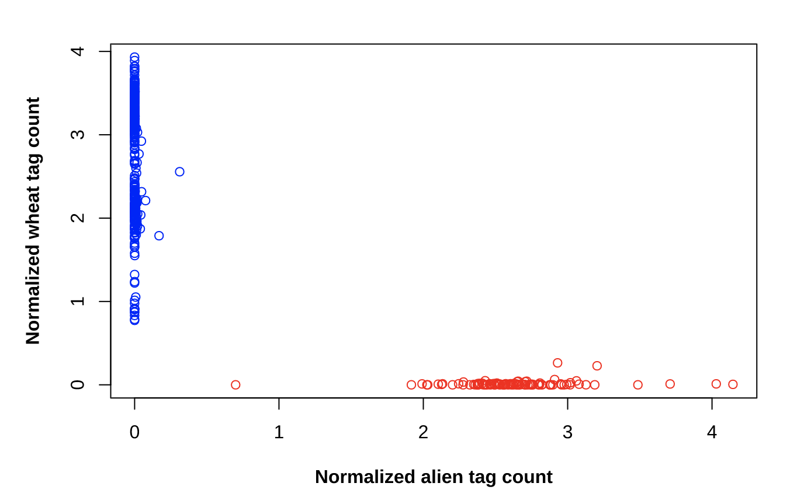

# Alien (2NS) Predict Based on GBS data
## (1) Run TASSEL GBSv2 pipeline to get the database populated. 
Please refer [here](https://bitbucket.org/tasseladmin/tassel-5-source/wiki/Tassel5GBSv2Pipeline) for details. We would need the .db file and .ReadsPerSample.log file to normalize reads

## (2) Extract tag by taxa file for selected tags
```bash
#!/bin/bash
prj_name='ventri2ns_sub483'
prj_dir='~/ventri2ns/data/gbs/gbs_KS_to2A2N_v3_sub483'; 
cd $prj_dir
tasselPath="~/src/tassel-5-modif/run_pipeline.pl" 
## needs to replace the sTASSEL.jar file with modified .jar (f66b3f4d37aa51e401f44b9eaacad45c) to use GetSelTagTaxaDistFromDBPlugin
sqlite_db='ventri2ns.db'
seltags='~/ventri2ns/zz_results/rebuild.2ns.based.on.tassel/archive/171130.tags.cmb.txt'

## GetSelTagTaxaDistFromDBPlugin extract tags and their taxa distribution
$tasselPath -Xms10G -Xmx40G -fork1 -GetSelTagTaxaDistFromDBPlugin \
    -db $sqlite_db\
    -o ${prj_name}_SelTagTaxaDistOutput.txt \
    -tg $seltags\
    -endPlugin -runfork1 > z_${prj_name}_GetSelTagTaxaDistFromDBPlugin.out \
    2> z_${prj_name}_GetSelTagTaxaDistFromDBPlugin.err

```

## (3) Import the geno_predict function and predict the results

```R
library(data.table)
source("~/Alien_Predict/scripts/functions/fn01_geno_predict.R")

my.results = geno_predict(atag.file = "~/Alien_Predict/data/2NS/KSU//tags.alien.txt", 
    wtag.file = "~/Alien_Predict/data/2NS/KSU//tags.wheat.txt", 
    tbt = "~/ventri2ns/data/gbs/gbs_KS_to2A2N_v3_sub483/ventri2ns_sub483_SelTagTaxaDistOutput.txt", 
    log = "~/ventri2ns/data/gbs/gbs_KS_to2A2N_v3_sub483/170708.orig28_minus_1_ReadsPerSample.log")
my.results[!is.na(adjusted.predict), plot(norm1, norm2, col = COL, 
    xlab = "Normalized alien tag count", ylab = "Normalized wheat tag count", 
    font.lab = 2)]
```


